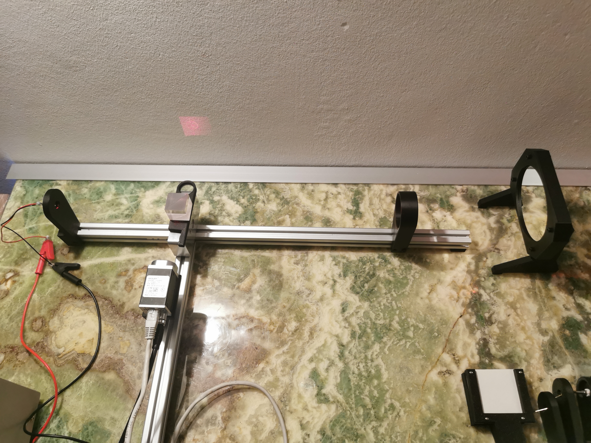
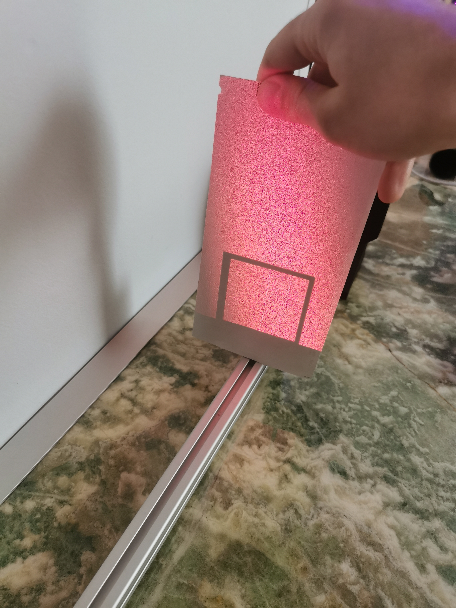
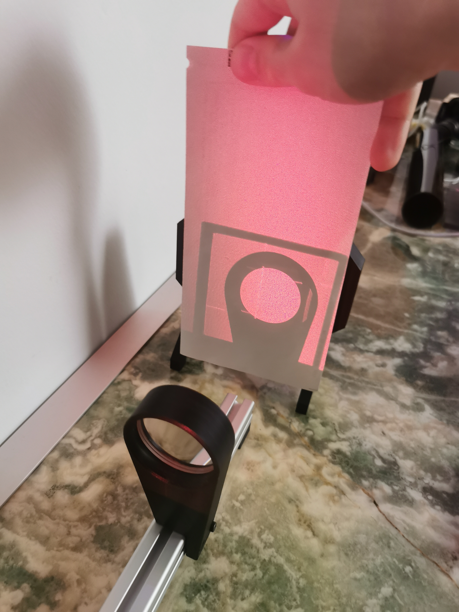

# Autocollimator Software (WIP)

Using a Basler GigE Webcam
The Live view:

The Straightness measuring interface:

This is the first crappy setup. It delivers surprisingly good results. It can hold within 2 arcseconds for several minutes (angle over time in both X and Y are the two plots on the right). It is very sensitive to vibration (even loud music?).
Just using a crappy laser diode (without any lens), a beam splitter, a f=385mm 42mm lens and a Basler camera.

The Program averages the intensity of the projected circle to find the center (rather poorly atm).  
The camera can handle up to 51 frames per second at full HD. This allows for tons of averaging, which also further reduces measurement noise.  
I also implemented a straightness measurement procedure already. Here measurements over a certain amount of time (typically 3s) are averaged at each position. 
I added boxes to be able to enter various parameters. It directly detrends the values and calculates the peak-to-valley deviation. 

There is a lot left to do but this is very promising. One important thing is building a sine bar to confirm the measurements.  
The Setup:

What the beam looks like from the laser Diode outwards:



A Field stop is needed to reduce the size of the beam coming from the laser.

## Installation

- Clone the repository to your system
- Install python 3.10 or newer: [get python](https://www.python.org/downloads/)
- Install pip package manager with ```python -m ensurepip --upgrade```
- Install requirements with ```pip install -r requirements.txt```
