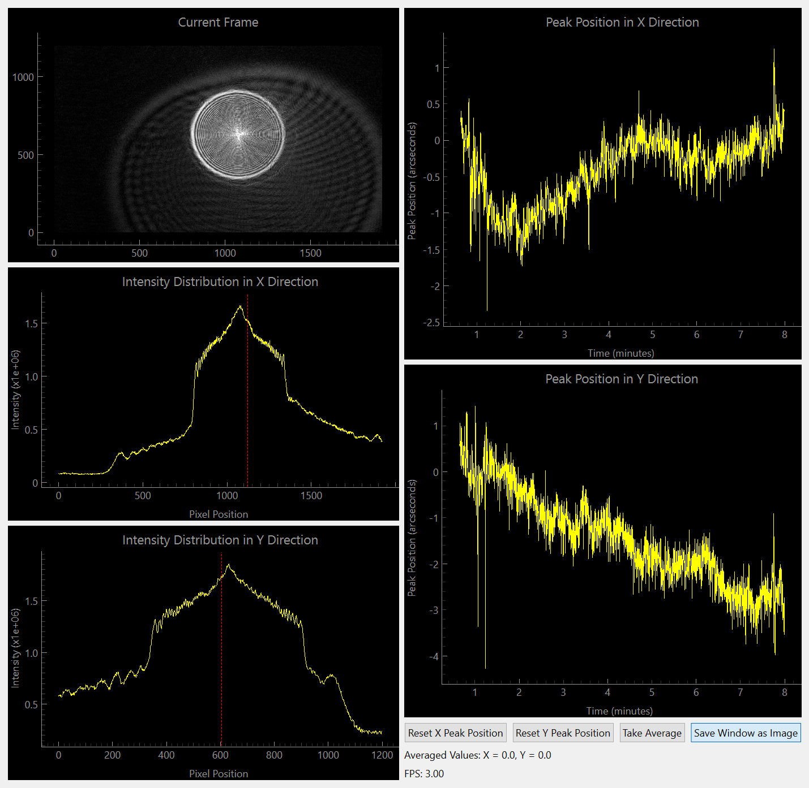
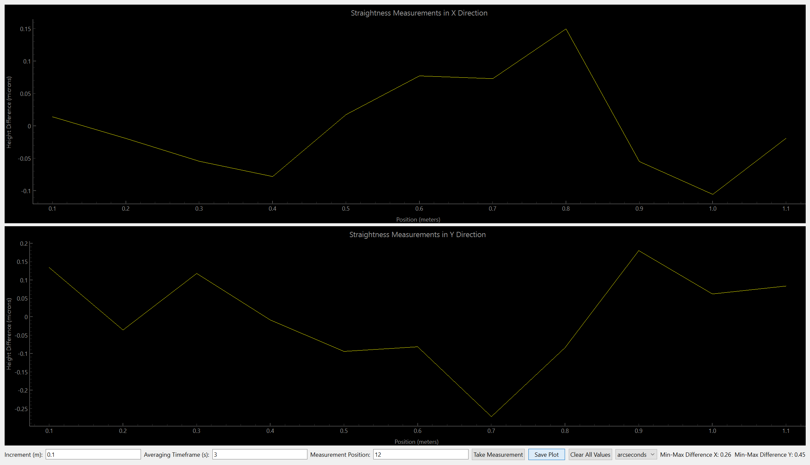

# Autocollimator Software

Using a Basler GigE Webcam
The Live view:

The Straightness measuring interface:


## Installation

- Clone the repository to your system
- Install python 3.10 or newer: [get python](https://www.python.org/downloads/)
- Install pip package manager with ```python -m ensurepip --upgrade```
- Install requirements with ```pip install -r requirements.txt```